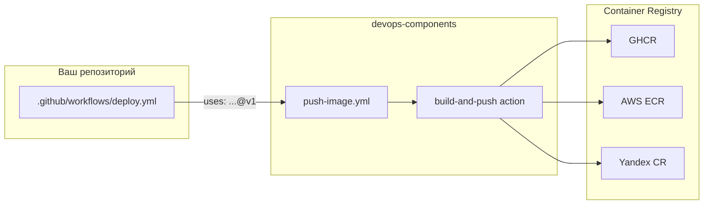
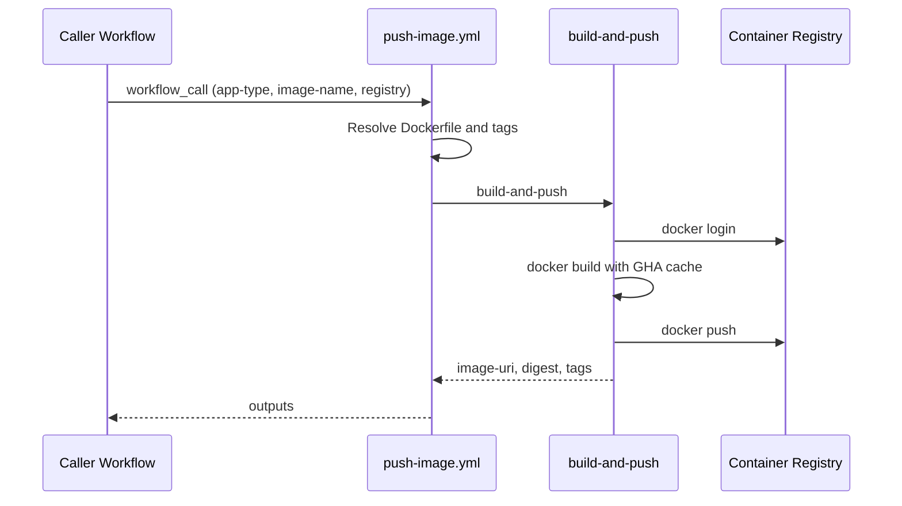

# devops-components

**Reusable CI/CD components for GitHub Actions — build & push Docker images for Next.js and Node.js in one line.**

[](LICENSE)
[](.github/workflows/push-image.yml)
[](docker/)

> **TL;DR (EN):** Stop copy-pasting Docker build/push YAML into every repo. Use one reusable workflow — `push-image.yml` — to build and push Next.js or Node.js images to GHCR, AWS ECR, or Yandex Container Registry.

---

# devops-components — переиспользуемые CI/CD-компоненты для GitHub Actions

**Один reusable workflow вместо копипасты Docker build/push в каждом репозитории.**

Собирайте и публикуйте Docker-образы Next.js-приложений и Node.js-бэкендов в container registry — через единый вызов `uses:`. Подключите за 2 минуты, переиспользуйте во всех проектах.

---

## Содержание

- [Зачем это нужно](#зачем-это-нужно)
- [Быстрый старт](#быстрый-старт)
- [Компоненты](#компоненты)
- [Универсальная джоба push-image](#универсальная-джоба-push-image)
- [Подключение в своём репозитории](#подключение-в-своём-репозитории)
- [Поддерживаемые registry](#поддерживаемые-registry)
- [Версионирование](#версионирование)
- [Архитектура](#архитектура)
- [FAQ](#faq)
- [Roadmap](#roadmap)
- [Contributing](#contributing)
- [License](#license)

---

## Зачем это нужно

### Проблема

В каждом репозитории одна и та же история:

- 80+ строк YAML для `docker build` + `docker push`
- Разные версии `docker/build-push-action` в разных проектах
- Расхождение тегов (`latest` vs `sha-abc` vs semver)
- Отдельные Dockerfile для Next.js и Node.js, скопированные с небольшими отличиями
- Сложно обновить CI/CD сразу во всех репозиториях

### Решение

**devops-components** — библиотека готовых DevOps-компонентов. Пишете один раз, подключаете везде:

| Было (в каждом репо) | Стало (devops-components) |
|----------------------|---------------------------|
| 80+ строк workflow YAML | 15 строк `uses:` |
| Свой Dockerfile с нуля | Reference Dockerfile + override |
| Ручной login в registry | Автоматический login (GHCR/ECR/YCR) |
| Копипаста между проектами | `@v1` — одна версия для всех |

---

## Быстрый старт

### Next.js — push образа в GHCR

```yaml
# .github/workflows/deploy.yml
name: Deploy Next.js

on:
  push:
    branches: [main]

jobs:
  push-image:
    uses: DiegoCalleri/devops-components/.github/workflows/push-image.yml@v1
    with:
      app-type: nextjs
      image-name: ${{ github.repository }}
      registry: ghcr
    secrets:
      REGISTRY_USERNAME: ${{ github.actor }}
      REGISTRY_PASSWORD: ${{ secrets.GITHUB_TOKEN }}
```

### Node.js backend — push образа в GHCR

```yaml
# .github/workflows/deploy.yml
name: Deploy Node.js API

on:
  push:
    branches: [main]

jobs:
  push-image:
    uses: DiegoCalleri/devops-components/.github/workflows/push-image.yml@v1
    with:
      app-type: nodejs
      image-name: ${{ github.repository }}
      registry: ghcr
    secrets:
      REGISTRY_USERNAME: ${{ github.actor }}
      REGISTRY_PASSWORD: ${{ secrets.GITHUB_TOKEN }}
```

> **Важно:** скопируйте reference Dockerfile из [`docker/`](docker/) в корень вашего репозитория. Подробнее — в разделе [Подключение](#подключение-в-своём-репозитории).

---

## Компоненты

### 1. Push Next.js image

Сборка production-ready Docker-образа Next.js с `output: standalone` и push в container registry.

| | |
|---|---|
| **Когда использовать** | SSR/ISR Next.js приложения, self-hosted деплой, Kubernetes, Coolify |
| **Dockerfile** | [`docker/nextjs.Dockerfile`](docker/nextjs.Dockerfile) |
| **Особенности** | Multi-stage build, layer caching (GHA cache), non-root user, healthcheck |
| **Build-args** | `NEXT_PUBLIC_*` переменные, `NODE_ENV=production` |

**Требования в `next.config.js`:**

```js
/** @type {import('next').NextConfig} */
const nextConfig = {
  output: 'standalone',
};
module.exports = nextConfig;
```

**Пример:** [`examples/nextjs-app/`](examples/nextjs-app/)

---

### 2. Push Node.js backend image

Сборка минимального production-образа для Node.js API (Express, Fastify, NestJS и др.).

| | |
|---|---|
| **Когда использовать** | REST/GraphQL API, микросервисы, worker-процессы |
| **Dockerfile** | [`docker/nodejs.Dockerfile`](docker/nodejs.Dockerfile) |
| **Особенности** | Prod-only dependencies, non-root user, healthcheck на `/health` |
| **Build-args** | `NODE_ENV=production` |

**Настройте `CMD`** в Dockerfile под ваш фреймворк:

```dockerfile
# Express / Fastify
CMD ["node", "dist/index.js"]

# NestJS
CMD ["node", "dist/main.js"]
```

**Пример:** [`examples/nodejs-api/`](examples/nodejs-api/)

---

### 3. Универсальная джоба `push-image`

Одна reusable workflow для обоих типов приложений. Различия задаются через `app-type` — Dockerfile, build-args и теги подставляются автоматически.

Файл: [`.github/workflows/push-image.yml`](.github/workflows/push-image.yml)

---

## Универсальная джоба push-image

### Inputs

| Input | Обязательный | По умолчанию | Описание |
|-------|:------------:|--------------|----------|
| `app-type` | ✅ | — | `nextjs` или `nodejs` |
| `image-name` | ✅ | — | Имя образа без registry (например `my-org/my-app`) |
| `registry` | | `ghcr` | `ghcr`, `ecr`, `ycr`, `custom` |
| `registry-url` | | `""` | URL registry (обязателен при `registry: custom`) |
| `dockerfile` | | `""` | Путь к Dockerfile (override пресета) |
| `context` | | `.` | Docker build context |
| `tags` | | `latest,sha-<short>` | Теги через запятую |
| `build-args` | | `""` | Дополнительные build-args (`KEY=VALUE` построчно) |
| `platforms` | | `linux/amd64` | Целевые платформы |
| `push` | | `true` | Пушить образ в registry |

### Secrets

| Secret | Когда нужен | Описание |
|--------|-------------|----------|
| `REGISTRY_USERNAME` | GHCR, custom | Username для login |
| `REGISTRY_PASSWORD` | GHCR, custom | Token / password |
| `AWS_ACCESS_KEY_ID` | ECR | AWS access key |
| `AWS_SECRET_ACCESS_KEY` | ECR | AWS secret key |
| `AWS_REGION` | ECR | AWS region |
| `YC_SA_JSON_CREDENTIALS` | YCR | JSON credentials сервисного аккаунта |
| `YC_REGISTRY_ID` | YCR | ID Yandex Container Registry |

### Outputs

| Output | Описание |
|--------|----------|
| `image-uri` | Полный URI образа с первым тегом |
| `image-digest` | Digest образа (`sha256:...`) |
| `image-tags` | Список тегов через запятую |

### Пример с outputs

```yaml
jobs:
  push-image:
    uses: DiegoCalleri/devops-components/.github/workflows/push-image.yml@v1
    with:
      app-type: nodejs
      image-name: my-org/api
      registry: ghcr
    secrets: inherit

  deploy:
    needs: push-image
    runs-on: ubuntu-latest
    steps:
      - run: echo "Deployed ${{ needs.push-image.outputs.image-uri }}"
```

---

## Подключение в своём репозитории

### Шаг 1. Скопируйте Dockerfile

```bash
# Для Next.js
curl -o Dockerfile https://raw.githubusercontent.com/DiegoCalleri/devops-components/main/docker/nextjs.Dockerfile

# Для Node.js backend
curl -o Dockerfile https://raw.githubusercontent.com/DiegoCalleri/devops-components/main/docker/nodejs.Dockerfile
```

### Шаг 2. Добавьте workflow

Скопируйте пример из [`examples/`](examples/) в `.github/workflows/deploy.yml`.

### Шаг 3. Настройте secrets

**GHCR (рекомендуется для GitHub-проектов):**

| Secret | Значение |
|--------|----------|
| `REGISTRY_USERNAME` | `${{ github.actor }}` (передаётся в workflow) |
| `REGISTRY_PASSWORD` | `${{ secrets.GITHUB_TOKEN }}` (встроенный token) |

Для приватных пакетов добавьте `permissions: packages: write` в caller workflow.

**AWS ECR:**

```
AWS_ACCESS_KEY_ID
AWS_SECRET_ACCESS_KEY
AWS_REGION
```

**Yandex Container Registry:**

```
YC_SA_JSON_CREDENTIALS
YC_REGISTRY_ID
```

### Шаг 4. Запиньте версию

```yaml
uses: DiegoCalleri/devops-components/.github/workflows/push-image.yml@v1
```

Используйте `@v1` в продакшене, не `@main`.

### Шаг 5. Проверьте

```bash
git push origin main
# → Actions tab → workflow "Deploy" → образ в registry
```

---

## Поддерживаемые registry

### GitHub Container Registry (GHCR)

```yaml
with:
  registry: ghcr
  image-name: ${{ github.repository }}  # → ghcr.io/owner/repo
secrets:
  REGISTRY_USERNAME: ${{ github.actor }}
  REGISTRY_PASSWORD: ${{ secrets.GITHUB_TOKEN }}
```

### AWS Elastic Container Registry (ECR)

```yaml
with:
  registry: ecr
  image-name: my-backend
secrets:
  AWS_ACCESS_KEY_ID: ${{ secrets.AWS_ACCESS_KEY_ID }}
  AWS_SECRET_ACCESS_KEY: ${{ secrets.AWS_SECRET_ACCESS_KEY }}
  AWS_REGION: eu-west-1
```

Пример: [`examples/nodejs-api/.github/workflows/deploy-ecr.yml`](examples/nodejs-api/.github/workflows/deploy-ecr.yml)

### Yandex Container Registry (YCR)

```yaml
with:
  registry: ycr
  image-name: my-app
secrets:
  YC_SA_JSON_CREDENTIALS: ${{ secrets.YC_SA_JSON_CREDENTIALS }}
  YC_REGISTRY_ID: ${{ secrets.YC_REGISTRY_ID }}
```

### Custom registry

```yaml
with:
  registry: custom
  registry-url: registry.example.com
  image-name: my-org/my-app
secrets:
  REGISTRY_USERNAME: ${{ secrets.REGISTRY_USERNAME }}
  REGISTRY_PASSWORD: ${{ secrets.REGISTRY_PASSWORD }}
```

---

## Версионирование

| Тег | Назначение |
|-----|-----------|
| `@v1` | Стабильная major-версия (рекомендуется) |
| `@v1.0.0` | Конкретный релиз |
| `@main` | Latest (для тестирования) |

- **Semver:** `v1.0.0`, `v1.1.0`, `v2.0.0`
- **Breaking changes** → новая major-версия (`@v2`)
- **Changelog** → [GitHub Releases](https://github.com/DiegoCalleri/devops-components/releases)

---

## Архитектура



### Последовательность push



### Структура репозитория

```
devops-components/
├── README.md
├── LICENSE
├── .github/
│   └── workflows/
│       └── push-image.yml          # Универсальный reusable workflow
├── actions/
│   └── build-and-push/
│       └── action.yml              # Composite action: login + build + push
├── docker/
│   ├── nextjs.Dockerfile           # Reference для Next.js
│   └── nodejs.Dockerfile           # Reference для Node.js backend
└── examples/
    ├── nextjs-app/
    │   └── .github/workflows/deploy.yml
    └── nodejs-api/
        └── .github/workflows/
            ├── deploy.yml
            └── deploy-ecr.yml
```

---

## FAQ

### Как пушить Docker-образ Next.js в GHCR через GitHub Actions?

1. Скопируйте [`docker/nextjs.Dockerfile`](docker/nextjs.Dockerfile) в корень проекта
2. Добавьте `output: 'standalone'` в `next.config.js`
3. Создайте `.github/workflows/deploy.yml` с `app-type: nextjs` (см. [Быстрый старт](#быстрый-старт))
4. Push в `main` — образ появится в `ghcr.io/<owner>/<repo>`

### Как переиспользовать workflow из другого репозитория?

```yaml
jobs:
  my-job:
    uses: DiegoCalleri/devops-components/.github/workflows/push-image.yml@v1
    with:
      app-type: nextjs
      image-name: my-org/my-app
      registry: ghcr
    secrets: inherit
```

Документация GitHub: [Reusing workflows](https://docs.github.com/en/actions/using-workflows/reusing-workflows)

### Чем отличается `app-type: nextjs` от `nodejs`?

| | `nextjs` | `nodejs` |
|---|----------|----------|
| **Назначение** | Frontend (Next.js SSR/ISR) | Backend API |
| **Dockerfile** | Standalone output, static assets | Prod deps only, dist/ |
| **Порт** | 3000 (Next.js server) | 3000 (настраивается) |
| **Healthcheck** | `GET /` | `GET /health` |
| **Build-args** | `NEXT_PUBLIC_*` | `NODE_ENV` |

Оба используют один workflow — различие только в пресете Dockerfile и build-args.

### Можно ли использовать свой Dockerfile?

Да. Передайте `dockerfile`:

```yaml
with:
  app-type: nextjs
  dockerfile: ./deploy/Dockerfile.prod
  image-name: my-org/my-app
  registry: ghcr
```

### Как кэшировать слои Docker в CI?

Кэширование включено по умолчанию через GitHub Actions cache (`cache-from: type=gha`). Повторные сборки используют закэшированные слои — сборка ускоряется в 2–5 раз.

### Поддерживается ли multi-arch (arm64 + amd64)?

В текущей версии — `linux/amd64` по умолчанию. Multi-arch (`linux/amd64,linux/arm64`) — в [Roadmap](#roadmap). Можно передать `platforms` input уже сейчас:

```yaml
with:
  platforms: linux/amd64,linux/arm64
```

### Можно ли пушить в S3 / object storage вместо registry?

Текущий компонент работает с **container registry** (GHCR, ECR, YCR). Загрузка tar-артефактов в S3/GCS — отдельный компонент в roadmap. Если нужен — [создайте issue](https://github.com/DiegoCalleri/devops-components/issues/new).

---

## Roadmap

- [ ] Multi-arch builds (`linux/amd64`, `linux/arm64`)
- [ ] Сканирование образов (Trivy / Grype)
- [ ] Deploy-хуки (Kubernetes, Coolify, Docker Swarm)
- [ ] Upload артефактов в S3 / object storage
- [ ] GitLab CI templates
- [ ] Composite action для lint + test + push (полный pipeline)

---

## Contributing

Новые компоненты приветствуются!

1. Fork репозитория
2. Создайте ветку (`git checkout -b feature/my-component`)
3. Добавьте компонент + пример в `examples/`
4. Обновите README
5. Откройте Pull Request

Для предложений — [создайте issue](https://github.com/DiegoCalleri/devops-components/issues/new).

---

## License

[MIT](LICENSE) © 2026 Diego Calleri
