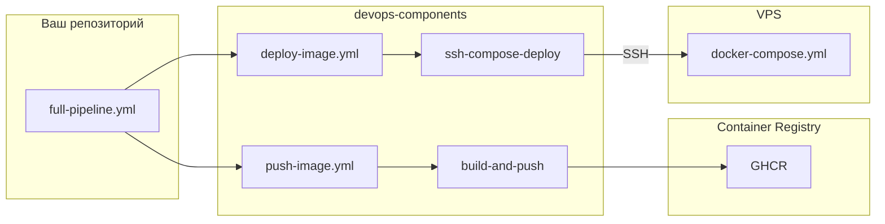
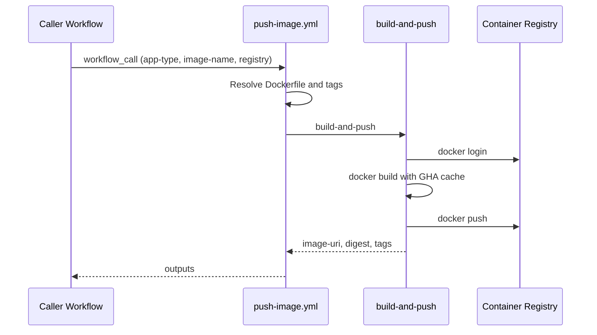

# devops-components

**Reusable CI/CD components for GitHub Actions — build, push, and deploy Docker images for Next.js, Node.js, and Go.**

[](LICENSE)
[](.github/workflows/push-image.yml)
[](docker/)

> **TL;DR (EN):** Stop copy-pasting Docker CI/CD YAML into every repo. Use reusable workflows — `push-image.yml` to build & push, `deploy-image.yml` to deploy via SSH + docker compose on your VPS.

---

# devops-components — переиспользуемые CI/CD-компоненты для GitHub Actions

**Два reusable workflow: build/push в registry и deploy на VPS — вместо копипасты CI/CD в каждом репозитории.**

Собирайте, публикуйте и деплойте Docker-образы Next.js, Node.js и Go — через единый вызов `uses:`. Подключите за 2 минуты, переиспользуйте во всех проектах.

---

## Содержание

- [Зачем это нужно](#зачем-это-нужно)
- [Быстрый старт](#быстрый-старт)
- [Компоненты](#компоненты)
- [Универсальная джоба push-image](#универсальная-джоба-push-image)
- [Deploy image на VPS](#deploy-image-на-vps)
- [Full pipeline: push + deploy](#full-pipeline-push--deploy)
- [Подключение в своём репозитории](#подключение-в-своём-репозитории)
- [Поддерживаемые registry](#поддерживаемые-registry)
- [Версионирование](#версионирование)
- [Архитектура](#архитектура)
- [FAQ](#faq)
- [Roadmap](#roadmap)
- [Contributing](#contributing)
- [License](#license)

---

## Зачем это нужно

### Проблема

В каждом репозитории одна и та же история:

- 80+ строк YAML для `docker build` + `docker push`
- Разные версии `docker/build-push-action` в разных проектах
- Расхождение тегов (`latest` vs `sha-abc` vs semver)
- Отдельные Dockerfile для Next.js, Node.js и Go, скопированные с небольшими отличиями
- Сложно обновить CI/CD сразу во всех репозиториях

### Решение

**devops-components** — библиотека готовых DevOps-компонентов. Пишете один раз, подключаете везде:

| Было (в каждом репо) | Стало (devops-components) |
|----------------------|---------------------------|
| 80+ строк workflow YAML | 15 строк `uses:` |
| Свой Dockerfile с нуля | Reference Dockerfile + override |
| Ручной login в registry | Автоматический login (GHCR/ECR/YCR) |
| Копипаста между проектами | `@v1` — одна версия для всех |

---

## Быстрый старт

### Next.js — push образа в GHCR

```yaml
# .github/workflows/deploy.yml
name: Deploy Next.js

on:
  push:
    branches: [main]

permissions:
  contents: read
  packages: write

jobs:
  push-image:
    uses: DiegoCalleri/devops-components/.github/workflows/push-image.yml@v1
    with:
      app-type: nextjs
      image-name: ${{ github.repository }}
      registry: ghcr
    secrets:
      REGISTRY_USERNAME: ${{ github.actor }}
      REGISTRY_PASSWORD: ${{ secrets.GITHUB_TOKEN }}
```

### Node.js backend — push образа в GHCR

```yaml
# .github/workflows/deploy.yml
name: Deploy Node.js API

on:
  push:
    branches: [main]

permissions:
  contents: read
  packages: write

jobs:
  push-image:
    uses: DiegoCalleri/devops-components/.github/workflows/push-image.yml@v1
    with:
      app-type: nodejs
      image-name: ${{ github.repository }}
      registry: ghcr
    secrets:
      REGISTRY_USERNAME: ${{ github.actor }}
      REGISTRY_PASSWORD: ${{ secrets.GITHUB_TOKEN }}
```

### Go backend — push образа в GHCR

```yaml
# .github/workflows/deploy.yml
name: Deploy Go API

on:
  push:
    branches: [main]

permissions:
  contents: read
  packages: write

jobs:
  push-image:
    uses: DiegoCalleri/devops-components/.github/workflows/push-image.yml@v1
    with:
      app-type: go
      image-name: ${{ github.repository }}
      registry: ghcr
      build-args: |
        MAIN_PACKAGE=./cmd/server
    secrets:
      REGISTRY_USERNAME: ${{ github.actor }}
      REGISTRY_PASSWORD: ${{ secrets.GITHUB_TOKEN }}
```

> Для `main.go` в корне передайте `MAIN_PACKAGE=.`. Подробнее — в разделе [Push Go image](#3-push-go-image).

> **Важно:** скопируйте reference Dockerfile из [`docker/`](docker/) в корень вашего репозитория. Подробнее — в разделе [Подключение](#подключение-в-своём-репозитории).

---

## Компоненты

### 1. Push Next.js image

Сборка production-ready Docker-образа Next.js с `output: standalone` и push в container registry.

| | |
|---|---|
| **Когда использовать** | SSR/ISR Next.js приложения, self-hosted деплой, Kubernetes, Coolify |
| **Dockerfile** | [`docker/nextjs.Dockerfile`](docker/nextjs.Dockerfile) |
| **Особенности** | Multi-stage build, layer caching (GHA cache), non-root user, healthcheck |
| **Build-args** | `NEXT_PUBLIC_*` переменные, `NODE_ENV=production` |

**Требования в `next.config.js`:**

```js
/** @type {import('next').NextConfig} */
const nextConfig = {
  output: 'standalone',
};
module.exports = nextConfig;
```

**Пример:** [`examples/nextjs-app/`](examples/nextjs-app/)

---

### 2. Push Node.js backend image

Сборка минимального production-образа для Node.js API (Express, Fastify, NestJS и др.).

| | |
|---|---|
| **Когда использовать** | REST/GraphQL API, микросервисы, worker-процессы |
| **Dockerfile** | [`docker/nodejs.Dockerfile`](docker/nodejs.Dockerfile) |
| **Особенности** | Prod-only dependencies, non-root user, healthcheck на `/health` |
| **Build-args** | `NODE_ENV=production` |

**Настройте `CMD`** в Dockerfile под ваш фреймворк:

```dockerfile
# Express / Fastify
CMD ["node", "dist/index.js"]

# NestJS
CMD ["node", "dist/main.js"]
```

**Пример:** [`examples/nodejs-api/`](examples/nodejs-api/)

---

### 3. Push Go image

Сборка минимального production-образа для Go API (Gin, Echo, Fiber, stdlib net/http и др.).

| | |
|---|---|
| **Когда использовать** | REST/gRPC API, workers, микросервисы |
| **Dockerfile** | [`docker/go.Dockerfile`](docker/go.Dockerfile) |
| **Особенности** | Static binary (`CGO_ENABLED=0`), non-root user, healthcheck на `/health` |
| **Build-args** | `MAIN_PACKAGE`, `CGO_ENABLED`, `LDFLAGS` |

**Настройте entry point** через `MAIN_PACKAGE` в `build-args`:

```yaml
build-args: |
  MAIN_PACKAGE=./cmd/server
```

```yaml
# main.go в корне
build-args: |
  MAIN_PACKAGE=.
```

**Добавьте endpoint `/health`** для HEALTHCHECK в Dockerfile.

**Пример:** [`examples/go-api/`](examples/go-api/)

---

### 4. Deploy image на VPS (SSH + docker compose)

Деплой образа из registry на сервер: SSH → `docker login` → `docker compose pull` → `docker compose up`.

| | |
|---|---|
| **Когда использовать** | VPS, bare metal, self-hosted сервер с Docker |
| **Compose template** | [`deploy/docker-compose.yml`](deploy/docker-compose.yml) |
| **Workflow** | [`.github/workflows/deploy-image.yml`](.github/workflows/deploy-image.yml) |
| **Особенности** | 5 режимов получения тега (`image-ref-mode`), registry login на сервере |

**Пример:** [`examples/nextjs-app/.github/workflows/full-pipeline.yml`](examples/nextjs-app/.github/workflows/full-pipeline.yml)

---

### 5. Универсальная джоба `push-image`

Одна reusable workflow для всех типов приложений. Различия задаются через `app-type` — Dockerfile, build-args и теги подставляются автоматически.

Файл: [`.github/workflows/push-image.yml`](.github/workflows/push-image.yml)

---

## Универсальная джоба push-image

### Inputs

| Input | Обязательный | По умолчанию | Описание |
|-------|:------------:|--------------|----------|
| `app-type` | ✅ | — | `nextjs`, `nodejs` или `go` |
| `image-name` | ✅ | — | Имя образа без registry (например `my-org/my-app`) |
| `registry` | | `ghcr` | `ghcr`, `ecr`, `ycr`, `custom` |
| `registry-url` | | `""` | URL registry (обязателен при `registry: custom`) |
| `dockerfile` | | `""` | Путь к Dockerfile (override пресета) |
| `context` | | `.` | Docker build context |
| `tags` | | `latest,sha-<short>` | Теги через запятую |
| `build-args` | | `""` | Дополнительные build-args (`KEY=VALUE` построчно) |
| `platforms` | | `linux/amd64` | Целевые платформы |
| `push` | | `true` | Пушить образ в registry |

### Secrets

| Secret | Когда нужен | Описание |
|--------|-------------|----------|
| `REGISTRY_USERNAME` | GHCR, custom | Username для login |
| `REGISTRY_PASSWORD` | GHCR, custom | Token / password |
| `AWS_ACCESS_KEY_ID` | ECR | AWS access key |
| `AWS_SECRET_ACCESS_KEY` | ECR | AWS secret key |
| `AWS_REGION` | ECR | AWS region |
| `YC_SA_JSON_CREDENTIALS` | YCR | JSON credentials сервисного аккаунта |
| `YC_REGISTRY_ID` | YCR | ID Yandex Container Registry |

### Outputs

| Output | Описание |
|--------|----------|
| `image-uri` | Полный URI образа с первым тегом (собирается из inputs, не из docker daemon — чтобы GitHub не блокировал output из-за secrets) |
| `image-digest` | Digest образа (`sha256:...`) |
| `image-tags` | Список тегов через запятую |

> **ECR/YCR:** output `image-uri` не экспортируется для `registry: ecr` и `registry: ycr`. В deploy используйте `image-ref-mode: digest` с `needs.push-image.outputs.image-digest`.

### Пример с outputs (ручной deploy)

```yaml
jobs:
  push-image:
    uses: DiegoCalleri/devops-components/.github/workflows/push-image.yml@v1
    with:
      app-type: nodejs
      image-name: my-org/api
      registry: ghcr
    secrets: inherit

  deploy:
    needs: push-image
    runs-on: ubuntu-latest
    steps:
      - run: echo "Image ready ${{ needs.push-image.outputs.image-uri }}"
```

---

## Deploy image на VPS

Reusable workflow: [`.github/workflows/deploy-image.yml`](.github/workflows/deploy-image.yml)

### Inputs

| Input | Обязательный | По умолчанию | Описание |
|-------|:------------:|--------------|----------|
| `image-ref-mode` | | `uri` | Режим разрешения образа (см. таблицу ниже) |
| `image-uri` | | `""` | Полный URI — для mode `uri` |
| `image-name` | | `""` | Имя без registry — для `tag` / `git-sha` / `latest` / `digest` |
| `image-tag` | | `""` | Явный тег — для mode `tag` |
| `image-digest` | | `""` | Digest — для mode `digest` |
| `registry` | | `ghcr` | `ghcr`, `ycr`, `custom` |
| `registry-url` | | `""` | URL registry (для `custom` / `ycr`) |
| `compose-path` | | `./docker-compose.yml` | Путь к compose **на сервере** |
| `compose-project` | | `""` | Имя проекта docker compose (`-p`) |
| `working-directory` | | `/opt/app` | Рабочая директория на сервере |
| `pull-only` | | `false` | Только pull без `up` |
| `env-file-path` | | `""` | Remote `.env` path to create/update before deploy |
| `env-content` | | `""` | Non-secret `.env` content generated from GitHub Variables |
| `force-recreate` | | `false` | Добавляет `--force-recreate` к `docker compose up` |
| `ssh-port` | | `22` | SSH порт |
| `debug` | | `false` | Подробная диагностика deploy: compose config, ps, последние логи |

### Secrets

| Secret | Описание |
|--------|----------|
| `SSH_HOST` | IP или домен VPS |
| `SSH_USER` | SSH username |
| `SSH_KEY` | SSH private key |
| `ENV_CONTENT` | Optional secret `.env` content appended after `env-content` |
| `REGISTRY_USERNAME` | Для `docker login` на сервере |
| `REGISTRY_PASSWORD` | Token / password |

### Outputs

| Output | Описание |
|--------|----------|
| `deployed-image-uri` | Задеплоенный URI образа |
| `deploy-status` | `success` |

### Режимы получения тега (`image-ref-mode`)

| Mode | Когда использовать | Как резолвится |
|------|-------------------|----------------|
| **`uri`** (default) | Push и deploy в одном workflow | `image-uri: ${{ needs.push-image.outputs.image-uri }}` |
| **`tag`** | Ручной деплой конкретной версии | `{registry}/{image-name}:{image-tag}` |
| **`git-sha`** | Деплой текущего коммита | `{registry}/{image-name}:sha-{GITHUB_SHA[:7]}` |
| **`latest`** | Деплой последнего образа | `{registry}/{image-name}:latest` |
| **`digest`** | Immutable deploy (production) | `{registry}/{image-name}@sha256:{digest}`. **Рекомендуется для ECR** — `image-digest: ${{ needs.push-image.outputs.image-digest }}` |

### Подготовка сервера

```bash
# На VPS
mkdir -p /opt/myapp
curl -o /opt/myapp/docker-compose.yml \
  https://raw.githubusercontent.com/DiegoCalleri/devops-components/main/deploy/docker-compose.yml
```

Reference compose использует `${IMAGE_URI}` — тег подставляется автоматически при деплое.
`.env` можно хранить на сервере вручную или генерировать из GitHub Variables/Secrets через `env-content`.

### Generate `.env` from GitHub Variables and Secrets

Передайте `env-content`, и компонент передаст содержимое через native SSH, запишет `.env` на сервере с `chmod 600`, а затем запустит `docker compose`.

```yaml
with:
  env-file-path: /opt/telegram-allegro/.env
  env-content: |
    FRONT_PORT=${{ vars.FRONT_PORT }}
    PRICES_URL=${{ vars.PRICES_URL }}
    REVALIDATE_SECONDS=${{ vars.REVALIDATE_SECONDS }}
    NEXT_PUBLIC_SCHOOL_URL=${{ vars.NEXT_PUBLIC_SCHOOL_URL }}
```

Для чувствительных значений создайте GitHub Secret `ENV_CONTENT` с несколькими строками:

```text
JWT_SECRET=...
API_KEY=...
DATABASE_URL=...
```

И передайте его в reusable workflow:

```yaml
secrets:
  ENV_CONTENT: ${{ secrets.ENV_CONTENT }}
```

Если заданы и `env-content`, и secret `ENV_CONTENT`, файл будет собран из обоих блоков: сначала public vars, затем secret lines.

Если `env-file-path` не указан, но `env-content` задан, файл будет создан как `${working-directory}/.env`.

Security notes:

- Не выводите `env-content` в логах и не включайте команды вроде `cat .env`.
- Компонент не печатает содержимое `.env` и `REGISTRY_PASSWORD`; в лог выводится только `ls -l` созданного файла.
- Для reusable workflows не смешивайте `${{ secrets.* }}` прямо в `with.env-content`; используйте secret `ENV_CONTENT`.
- Multiline `.env` передаётся через native SSH без SCP/tar/drone-ssh.

### Безопасность deploy

- SSH key храните только в GitHub Secrets (`SSH_KEY`), не в коде
- Для production используйте `image-ref-mode: digest` — immutable ссылка на образ
- Не запускайте deploy workflow на `pull_request` из форков
- Добавьте `.dockerignore` в прикладной сервис — секреты не должны попадать в образ
- `REGISTRY_PASSWORD` на сервере передаётся через env и маскируется в логах GitHub

---

## Full pipeline: push + deploy

```yaml
# .github/workflows/full-pipeline.yml
name: Build and Deploy

on:
  push:
    branches: [main]

permissions:
  contents: read
  packages: write

jobs:
  push-image:
    uses: DiegoCalleri/devops-components/.github/workflows/push-image.yml@v1
    with:
      app-type: nextjs
      image-name: ${{ github.repository }}
      registry: ghcr
    secrets:
      REGISTRY_USERNAME: ${{ github.actor }}
      REGISTRY_PASSWORD: ${{ secrets.GITHUB_TOKEN }}

  deploy:
    needs: push-image
    uses: DiegoCalleri/devops-components/.github/workflows/deploy-image.yml@v1
    with:
      image-ref-mode: uri
      image-uri: ${{ needs.push-image.outputs.image-uri }}
      working-directory: /opt/myapp
      compose-path: /opt/myapp/docker-compose.yml
      env-file-path: /opt/myapp/.env
      env-content: |
        NEXT_PUBLIC_API_URL=${{ vars.NEXT_PUBLIC_API_URL }}
      force-recreate: true
      # debug: true # enable temporarily when investigating deploy issues
    secrets:
      SSH_HOST: ${{ secrets.SSH_HOST }}
      SSH_USER: ${{ secrets.SSH_USER }}
      SSH_KEY: ${{ secrets.SSH_KEY }}
      REGISTRY_USERNAME: ${{ github.actor }}
      REGISTRY_PASSWORD: ${{ secrets.GITHUB_TOKEN }}
```

Для production рекомендуется `image-ref-mode: digest` с `image-digest: ${{ needs.push-image.outputs.image-digest }}`.

### Debug deploy

Если deploy job завершился успешно, но контейнер не обновился или не видно вывода `docker compose pull`, включите debug только в прикладном workflow:

```yaml
with:
  debug: true
```

Debug mode включает подробный вывод native SSH deploy: `IMAGE_URI`, `WORKING_DIRECTORY`, `COMPOSE_PATH`, `docker compose config`, `docker ps -a` и последние `docker compose logs --tail=100`. В логах также есть маркеры `[native-ssh] remote script started` и `[native-ssh] remote script finished`; если финального маркера нет, job завершится ошибкой. Пароль registry не выводится.

---

## Подключение в своём репозитории

### Шаг 1. Скопируйте Dockerfile

```bash
# Для Next.js
curl -o Dockerfile https://raw.githubusercontent.com/DiegoCalleri/devops-components/main/docker/nextjs.Dockerfile

# Для Node.js backend
curl -o Dockerfile https://raw.githubusercontent.com/DiegoCalleri/devops-components/main/docker/nodejs.Dockerfile

# Для Go backend
curl -o Dockerfile https://raw.githubusercontent.com/DiegoCalleri/devops-components/main/docker/go.Dockerfile
```

### Шаг 2. Добавьте workflow

Скопируйте пример из [`examples/`](examples/) в `.github/workflows/deploy.yml`.

### Шаг 3. Настройте secrets

**GHCR (рекомендуется для GitHub-проектов):**

| Secret | Значение |
|--------|----------|
| `REGISTRY_USERNAME` | `${{ github.actor }}` (передаётся в workflow) |
| `REGISTRY_PASSWORD` | `${{ secrets.GITHUB_TOKEN }}` (встроенный token) |

Для приватных пакетов добавьте `permissions: packages: write` в caller workflow.

**AWS ECR:**

```
AWS_ACCESS_KEY_ID
AWS_SECRET_ACCESS_KEY
AWS_REGION
```

**Yandex Container Registry:**

```
YC_SA_JSON_CREDENTIALS
YC_REGISTRY_ID
```

### Шаг 4. Запиньте версию

```yaml
uses: DiegoCalleri/devops-components/.github/workflows/push-image.yml@v1
```

Используйте `@v1` в продакшене, не `@main`.

### Шаг 5. Проверьте

```bash
git push origin main
# → Actions tab → workflow "Deploy" → образ в registry
```

---

## Поддерживаемые registry

### GitHub Container Registry (GHCR)

```yaml
with:
  registry: ghcr
  image-name: ${{ github.repository }}  # → ghcr.io/owner/repo
secrets:
  REGISTRY_USERNAME: ${{ github.actor }}
  REGISTRY_PASSWORD: ${{ secrets.GITHUB_TOKEN }}
```

### AWS Elastic Container Registry (ECR)

```yaml
with:
  registry: ecr
  image-name: my-backend
secrets:
  AWS_ACCESS_KEY_ID: ${{ secrets.AWS_ACCESS_KEY_ID }}
  AWS_SECRET_ACCESS_KEY: ${{ secrets.AWS_SECRET_ACCESS_KEY }}
  AWS_REGION: eu-west-1
```

Пример: [`examples/nodejs-api/.github/workflows/deploy-ecr.yml`](examples/nodejs-api/.github/workflows/deploy-ecr.yml)

### Yandex Container Registry (YCR)

```yaml
with:
  registry: ycr
  image-name: my-app
secrets:
  YC_SA_JSON_CREDENTIALS: ${{ secrets.YC_SA_JSON_CREDENTIALS }}
  YC_REGISTRY_ID: ${{ secrets.YC_REGISTRY_ID }}
```

### Custom registry

```yaml
with:
  registry: custom
  registry-url: registry.example.com
  image-name: my-org/my-app
secrets:
  REGISTRY_USERNAME: ${{ secrets.REGISTRY_USERNAME }}
  REGISTRY_PASSWORD: ${{ secrets.REGISTRY_PASSWORD }}
```

---

## Версионирование

| Тег | Назначение |
|-----|-----------|
| `@v1` | Стабильная major-версия (рекомендуется) |
| `@v1.0.0` | Конкретный релиз |
| `@main` | Latest (для тестирования) |

- **Semver:** `v1.0.0`, `v1.1.0`, `v2.0.0`
- **Breaking changes** → новая major-версия (`@v2`)
- **Changelog** → [GitHub Releases](https://github.com/DiegoCalleri/devops-components/releases)

---

## Архитектура



### Последовательность push



### Структура репозитория

```
devops-components/
├── README.md
├── LICENSE
├── .github/
│   └── workflows/
│       ├── push-image.yml          # Build + push в registry
│       └── deploy-image.yml        # Deploy на VPS через SSH
├── actions/
│   ├── build-and-push/
│   │   └── action.yml
│   └── ssh-compose-deploy/
│       └── action.yml
├── docker/
│   ├── nextjs.Dockerfile
│   ├── nodejs.Dockerfile
│   └── go.Dockerfile
├── deploy/
│   └── docker-compose.yml        # Reference compose для VPS
└── examples/
    ├── nextjs-app/
    │   └── .github/workflows/
    │       ├── deploy.yml
    │       └── full-pipeline.yml
    ├── nodejs-api/
    │   └── .github/workflows/
    │       ├── deploy.yml
    │       ├── deploy-ecr.yml
    │       └── full-pipeline.yml
    └── go-api/
        └── .github/workflows/
            ├── deploy.yml
            └── full-pipeline.yml
```

---

## FAQ

### Как пушить Docker-образ Next.js в GHCR через GitHub Actions?

1. Скопируйте [`docker/nextjs.Dockerfile`](docker/nextjs.Dockerfile) в корень проекта
2. Добавьте `output: 'standalone'` в `next.config.js`
3. Создайте `.github/workflows/deploy.yml` с `app-type: nextjs` (см. [Быстрый старт](#быстрый-старт))
4. Push в `main` — образ появится в `ghcr.io/<owner>/<repo>`

### Как переиспользовать workflow из другого репозитория?

```yaml
jobs:
  my-job:
    uses: DiegoCalleri/devops-components/.github/workflows/push-image.yml@v1
    with:
      app-type: nextjs
      image-name: my-org/my-app
      registry: ghcr
    secrets: inherit
```

Документация GitHub: [Reusing workflows](https://docs.github.com/en/actions/using-workflows/reusing-workflows)

### Чем отличается `app-type: nextjs` от `nodejs` и `go`?

| | `nextjs` | `nodejs` | `go` |
|---|----------|----------|------|
| **Назначение** | Frontend (Next.js SSR/ISR) | Backend API | Backend API / workers |
| **Dockerfile** | Standalone output, static assets | Prod deps only, dist/ | Static binary, alpine runner |
| **Порт** | 3000 (Next.js server) | 3000 (настраивается) | 8080 |
| **Healthcheck** | `GET /` | `GET /health` | `GET /health` |
| **Build-args** | `NEXT_PUBLIC_*` | `NODE_ENV` | `MAIN_PACKAGE`, `CGO_ENABLED`, `LDFLAGS` |

Все используют один workflow — различие только в пресете Dockerfile и build-args.

### Можно ли использовать свой Dockerfile?

Да. Передайте `dockerfile`:

```yaml
with:
  app-type: nextjs
  dockerfile: ./deploy/Dockerfile.prod
  image-name: my-org/my-app
  registry: ghcr
```

### Как кэшировать слои Docker в CI?

Кэширование включено по умолчанию через GitHub Actions cache (`cache-from: type=gha`). Повторные сборки используют закэшированные слои — сборка ускоряется в 2–5 раз.

### Поддерживается ли multi-arch (arm64 + amd64)?

В текущей версии — `linux/amd64` по умолчанию. Multi-arch (`linux/amd64,linux/arm64`) — в [Roadmap](#roadmap). Можно передать `platforms` input уже сейчас:

```yaml
with:
  platforms: linux/amd64,linux/arm64
```

### Почему `image-uri` был пустым в deploy?

GitHub Actions блокирует job outputs, если считает, что значение могло содержать секрет (`Skip output 'image-uri' since it may contain secret`).

**Причина:** раньше `image-uri` брался из composite action, который получал `REGISTRY_PASSWORD` и другие secrets.

**Исправлено:** `image-uri` теперь собирается в отдельном job без секретов (по публичным inputs `registry`, `registry-url`, `image-name`, `tags`).

Если всё ещё пусто:
1. Убедитесь, что используете актуальный `push-image.yml` из devops-components
2. Re-run **всех** jobs (не только deploy)
3. Для ECR/YCR используйте `image-ref-mode: digest` вместо `uri`

### Как задеплоить образ на VPS через GitHub Actions?

1. Скопируйте [`deploy/docker-compose.yml`](deploy/docker-compose.yml) на сервер в `/opt/myapp/`
2. Добавьте secrets: `SSH_HOST`, `SSH_USER`, `SSH_KEY`
3. Используйте [`full-pipeline.yml`](examples/nextjs-app/.github/workflows/full-pipeline.yml) как шаблон
4. Образ подтянется из registry и запустится через `docker compose up`

### Какой `image-ref-mode` выбрать?

- **push + deploy в одном workflow** → `uri` (передайте `needs.push-image.outputs.image-uri`)
- **production, immutable** → `digest` (передайте `needs.push-image.outputs.image-digest`)
- **ручной деплой версии** → `tag` (укажите `image-tag: v1.2.3`)
- **деплой текущего коммита** → `git-sha`
- **последний образ** → `latest`

### Можно ли пушить в S3 / object storage вместо registry?

Текущий компонент работает с **container registry** (GHCR, ECR, YCR). Загрузка tar-артефактов в S3/GCS — отдельный компонент в roadmap. Если нужен — [создайте issue](https://github.com/DiegoCalleri/devops-components/issues/new).

---

## Roadmap

- [x] Deploy на VPS через SSH + docker compose
- [ ] Multi-arch builds (`linux/amd64`, `linux/arm64`)
- [ ] Сканирование образов (Trivy / Grype)
- [ ] Deploy через webhook (Coolify, Portainer)
- [ ] Deploy в Kubernetes / Helm
- [ ] Upload артефактов в S3 / object storage
- [ ] GitLab CI templates
- [ ] Composite action для lint + test + push (полный pipeline)

---

## Contributing

Новые компоненты приветствуются!

1. Fork репозитория
2. Создайте ветку (`git checkout -b feature/my-component`)
3. Добавьте компонент + пример в `examples/`
4. Обновите README
5. Откройте Pull Request

Для предложений — [создайте issue](https://github.com/DiegoCalleri/devops-components/issues/new).

---

## License

[MIT](LICENSE) © 2026 Diego Calleri
